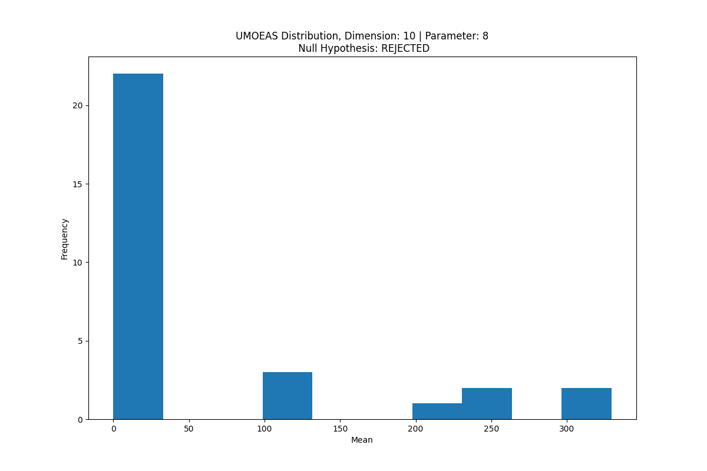
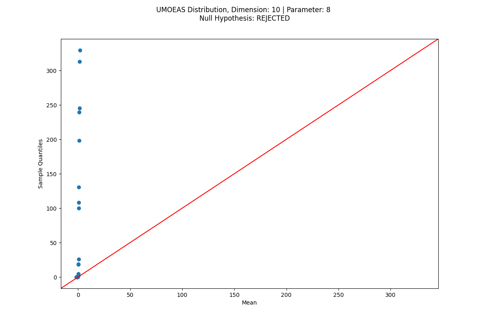
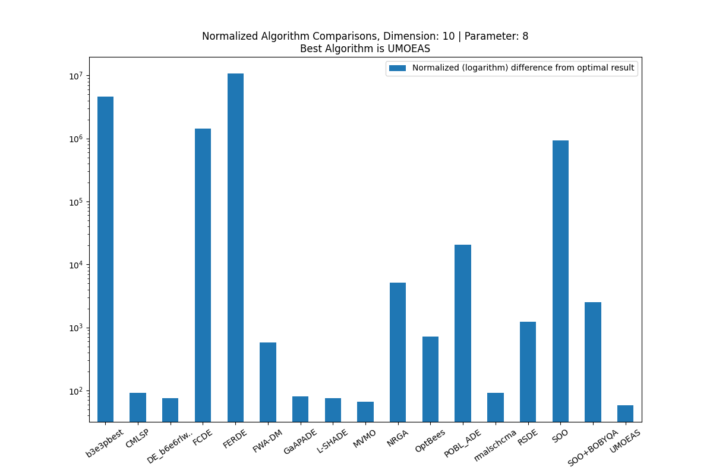
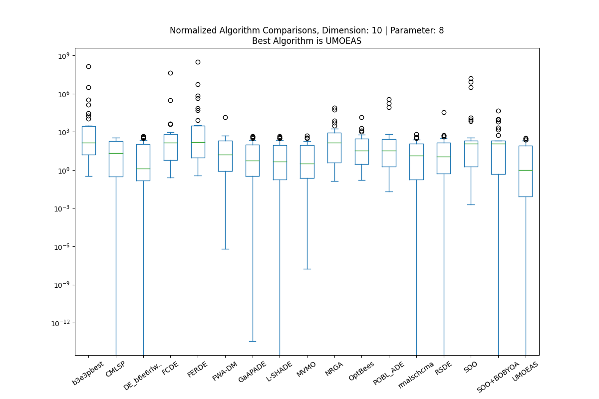
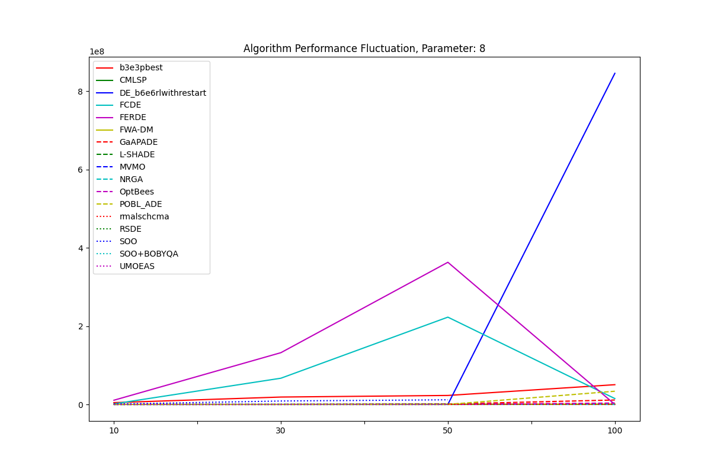
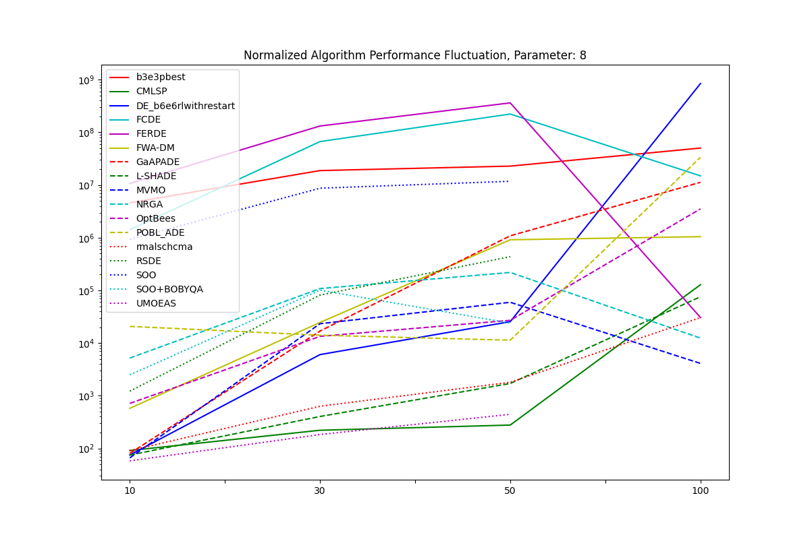

Algorithm Comparator
==============================
This is a submission of **assignment 3** for the **CIS711** course.

It contains the code necessary to conduct tests among selected algorithms and determine the most efficient algorithm.

This repository is merely a demonstration of how to perform statistical tests.

Getting Started
------------
Clone the project from GitHub

`$ git clone https://github.com/tariqshaban/algorithm-comparator.git`

Install numpy
`pip install numpy`

Install pandas
`pip install pandas`

install matplotlib
`pip install matplotlib`

install seaborn
`pip install seaborn`

Install scipy
`pip install scipy`

Install tabulate
`pip install tabulate`

Install statsmodels
`pip install statsmodels`

You may need to configure the Python interpreter (depending on the used IDE)

No further configuration is required.

Project Structure
------------
    ├── README.md                           <- The top-level README for developers using this project.
    │
    ├── assets
    │   │── algorithms                      <- Storing the provided algorithm's files.
    │   └── cached_instances                <- Storing processed tables.
    │
    ├── enums
    │   └── adjusted_p_value_methods        <- Enumerate adjusted p-value methods.
    │
    ├── helpers
    │   │── dataframe_beautifier            <- Static methods for beautifying the output of the dataframe.
    │   └── progress_handler                <- Set of static methods that aid some progress manipulations.
    │
    ├── providers
    │   │── data_acquisition_provider       <- Static methods which handles data acquisition and tranformation.
    │   │── data_manifest_provider          <- Static final attributes which informs any functionality of the excepted data to be received.
    │   │── plots_provider                  <- Static methods which perform the plotting functionality.
    │   └── non_parametric_tests_provider   <- Static methods which handles implementing nonparametric tests the transformed data.
    │
    └── main                                <- Acts as a sandbox for methods invocation

Data Exploration
------------
Data obtained from the CEC-2014 are stored in `assets/algorithms`, it consists of the following:

* A collection of folders, each folder denotes an algorithm.
* Each algorithm contains a collection of textual files, each file denotes a pair of problem/dimension
* Each problem/dimension pair contains a table, columns denote the iteration and rows denote the parameter
* Each cell denotes the difference between the actual and the optimal result for the respected 
algorithm/dimension/problem/parameter/iteration (the less the value is, the better)

Refer to the following tree for a better understanding

    └── CEC-2014
        │── b3e3pbest
        │   │── 10D
        │   │   │── problem 1
        │   │   │   │── parameter 1
        │   │   │   │   │── iteration 1
        │   │   │   │   │── iteration 2
        │   │   │   │   │── ...
        │   │   │   │   └── iteration 51
        │   │   │   │── parameter 2
        │   │   │   │── ...
        │   │   │   └── parameter 14
        │   │   │── problem 2
        │   │   │── problem 3
        │   │   │── ...
        │   │   └── problem 30
        │   │── 30D
        │   │── 50D
        │   └── 100D
        │── CMLSP
        │── DE_b6e6rlwithrestart
        │── ...
        └── UMOEAS
    
Preprocessing
------------
Data received from the CEC-2014 contains unnecessary additional files which should be removed.

Raw data from the textual files did not seem to require any preprocessing, since the data is assumed to be correct,
e.g. you cannot confirm that a difference of 3.2987*10^8 is considered as an entry error or that the algorithm did
actually obtain this result under certain circumstances. The only preprocessing that could have been done is to remove
any  non-positive values, but there was none already.

Inspection
------------

  
Normality check

> 
>  
It can be clearly indicated from this figure that the distribution of this algorithm is not normal, hence we should
conduct non-parametric tests.

> 
>  
The qq plot (which shows the distribution of the data against the expected normal distribution), should have the 
observations lie approximately on a straight line to consider the distribution normal. The figure also indicate that this not 
a normal distribution.

 

  
Comparisons

> 
>  
For a given dimension and parameter, we can estimate the best algorithm by using the mean value, in this plot,
we can conclude that UMOEAS is the best algorithm, since it has the least difference to the optimal result. However,
the best algorithm might be different for each dimension and parameter.

> 
>  
To further find the outliers in each algorithm distribution, we used the box plot, having a whisker which converges to 
the zero highly indicate that such algorithm might be the best. The best algorithm usually doesn't have outliers, 
or it is not very distant from the maximum whisker, we can estimate from the plot that UMOEAS is most likely the best 
algorithm since it has the lowest median (central horizontal line in the box), as well as the Q1 is relatively low.

 

  
Overall Performance

> 
>  
Display the performance for algorithm for a given parameter while escalating the dimensionality, some algorithms
surprisingly obtain better results when increasing the dimensionality, perhaps the algorithm is optimized to run on
a higher, demanding dimensions?

> 
>  
The previous figure has been normalized to further facilitate the interpretation of the performance, notice that some
algorithms doesn't have any performance indicators at 100D, this is because that the raw data didn't record any
observation that correlated the algorithm with the dimension.

Tests / Analysis
------------

### Loading textual files

The first step was to load the raw txt file into a nested dictionary and tag the required information as the key, while 
the textual content as the value in a dataframe format.

### Refactoring the loaded nested dictionary

Then nested dictionary was refactored to the following manner:
* A dictionary consisting of:
  * Key: Dimension name 
  * Value: A dictionary consisting of:
    * Key: Parameter name
    * Value: A dataframe consisting of:
      * Columns: Algorithm Name
      * Row: Problem number
      * Cell: Consists of mean and standard deviation of the provided 51 iteration
  
<ins>**Note that the parameters follow zero based indexing**, 0 denotes the first line in the txt file.</ins>

This ensures that the data is suitable for comparisons and tests, standard deviation is nullified if not needed.

The inspections above became possible after this step.

### Appending w/t/l to the refactored dataframe

Identifying the algorithm with the highest wins and ties can give a broad indication that this might be the best 
algorithm.

  
Algorithm comparison with w/t/l

Dimension: 10
 
Parameter: 8

| (Problem,'Mean/Std') | b3e3pbest  | CMLSP      | DE_b6e6rlwithrestart | FCDE       | FERDE      | FWA-DM     | GaAPADE    | L-SHADE    | MVMO       | NRGA       | OptBees    | POBL_ADE   | rmalschcma | RSDE       | SOO        | SOO+BOBYQA | UMOEAS     |
|:---------------------|------------|------------|----------------------|------------|------------|------------|------------|------------|------------|------------|------------|------------|------------|------------|------------|------------|------------|
| (1, 'Mean')          | 3.2173e+06 | 2.3678e-04 | 5.8170e-10           | 3.0817e+05 | 5.5689e+06 | 1.4336e+04 | 1.3320e-10 | 0.0000e+00 | 5.8577e+01 | 8.0011e+04 | 1.4400e+04 | 8.9204e+04 | 0.0000e+00 | 1.8677e-07 | 8.8108e+06 | 4.3670e+04 | 0.0000e+00 |
| (1, 'Std')           | 9.1182e+06 | 7.4361e-04 | 3.0164e-09           | 8.2251e+05 | 1.1186e+07 | 2.2851e+04 | 4.8530e-10 | 0.0000e+00 | 1.3415e+02 | 1.2553e+05 | 1.9735e+04 | 3.4845e+05 | 0.0000e+00 | 8.2445e-07 | 0.0000e+00 | 2.2668e-11 | 0.0000e+00 |
| (2, 'Mean')          | 1.3453e+08 | 1.1146e-15 | 0.0000e+00           | 4.2266e+07 | 3.1485e+08 | 1.4125e-04 | 5.7284e-10 | 0.0000e+00 | 2.7764e-05 | 9.2183e+02 | 1.2668e+03 | 1.7441e+05 | 0.0000e+00 | 0.0000e+00 | 1.0782e+01 | 4.2900e-01 | 2.6778e-06 |
| (2, 'Std')           | 4.2102e+08 | 5.5169e-15 | 0.0000e+00           | 1.5111e+08 | 9.1609e+08 | 9.5932e-04 | 3.3016e-09 | 0.0000e+00 | 4.4078e-05 | 1.1044e+03 | 1.4341e+03 | 1.1391e+06 | 0.0000e+00 | 0.0000e+00 | 1.9267e-15 | 0.0000e+00 | 1.7449e-05 |
| (3, 'Mean')          | 3.1643e+03 | 2.1990e-03 | 0.0000e+00           | 4.7480e+02 | 3.4392e+03 | 6.1074e-07 | 3.5666e-14 | 0.0000e+00 | 1.7640e-08 | 1.8000e+03 | 4.4148e+01 | 1.9483e-02 | 9.7943e+01 | 0.0000e+00 | 6.6483e+03 | 6.3311e+03 | 0.0000e+00 |
| (3, 'Std')           | 7.8280e+03 | 4.4071e-03 | 0.0000e+00           | 1.3640e+03 | 7.0176e+03 | 3.3466e-06 | 1.4932e-13 | 0.0000e+00 | 6.9825e-08 | 1.5625e+03 | 1.1830e+02 | 6.0747e-02 | 3.3176e+02 | 0.0000e+00 | 1.8234e-12 | 5.0942e-13 | 0.0000e+00 |
| (4, 'Mean')          | 2.7916e+01 | 4.4583e-15 | 6.6299e+00           | 5.7926e+00 | 3.0825e+01 | 2.5263e+00 | 3.0688e+01 | 2.9410e+01 | 9.5457e+00 | 1.5468e+01 | 3.2050e+00 | 2.9914e+01 | 8.5008e-02 | 1.2103e+01 | 1.5630e+00 | 0.0000e+00 | 1.1028e-03 |
| (4, 'Std')           | 5.1019e+01 | 1.5282e-14 | 1.2494e+01           | 1.3499e+01 | 6.7031e+01 | 1.5072e+00 | 1.1206e+01 | 1.2464e+01 | 1.4838e+01 | 1.6855e+01 | 2.9591e+00 | 1.4841e+01 | 6.0110e-01 | 1.6092e+01 | 2.5450e-16 | 0.0000e+00 | 6.8692e-03 |
| (5, 'Mean')          | 2.0224e+01 | 1.8898e+01 | 1.9249e+01           | 2.0488e+01 | 2.0102e+01 | 2.0117e+01 | 1.9813e+01 | 1.9093e+01 | 1.7366e+01 | 1.9607e+01 | 2.0000e+01 | 1.9812e+01 | 1.4286e+01 | 2.0001e+01 | 2.0000e+01 | 2.0000e+01 | 1.8844e+01 |
| (5, 'Std')           | 1.7312e-01 | 4.4276e+00 | 2.6751e+00           | 1.6668e-01 | 1.8721e-01 | 7.5261e-02 | 1.0909e+00 | 2.6043e+00 | 6.3759e+00 | 2.7728e+00 | 1.2727e-04 | 1.9046e+00 | 9.2228e+00 | 4.2556e-03 | 0.0000e+00 | 0.0000e+00 | 4.6818e+00 |
| (6, 'Mean')          | 3.3843e+00 | 5.0749e-01 | 1.7540e-02           | 5.7703e+00 | 3.6179e+00 | 7.2268e-01 | 5.1955e-01 | 5.5957e-02 | 1.6387e-02 | 2.5269e+00 | 3.8299e+00 | 1.0395e+00 | 1.7455e-03 | 3.6645e-01 | 2.0000e-03 | 2.0000e-03 | 1.1453e-03 |
| (6, 'Std')           | 3.9860e+00 | 1.0751e+00 | 1.2403e-01           | 1.3040e+00 | 3.3658e+00 | 6.4668e-01 | 9.0086e-01 | 2.0668e-01 | 4.3072e-02 | 1.2781e+00 | 1.6062e+00 | 7.7488e-01 | 6.0439e-03 | 6.9354e-01 | 3.0364e-19 | 3.0364e-19 | 7.9660e-03 |
| (7, 'Mean')          | 3.7232e+00 | 0.0000e+00 | 4.6975e-02           | 6.0965e-01 | 5.8060e+00 | 9.4823e-02 | 2.2279e-02 | 3.8303e-02 | 1.8855e-02 | 2.2108e-01 | 1.5978e-01 | 1.7237e-01 | 1.0379e-05 | 6.2573e-02 | 4.9000e-02 | 4.9000e-02 | 0.0000e+00 |
| (7, 'Std')           | 1.0662e+01 | 0.0000e+00 | 1.8042e-02           | 1.3960e+00 | 1.4586e+01 | 4.9192e-02 | 1.8054e-02 | 2.7094e-02 | 1.4428e-02 | 1.1435e-01 | 1.4321e-01 | 1.9425e-01 | 7.3392e-05 | 3.6570e-02 | 2.9149e-18 | 2.9149e-18 | 0.0000e+00 |
| (8, 'Mean')          | 1.4194e+01 | 4.2705e+00 | 0.0000e+00           | 1.6896e+01 | 8.8301e+00 | 2.5362e-01 | 1.9352e-01 | 2.4588e-02 | 3.2325e-03 | 7.2560e+00 | 6.6335e-01 | 8.0704e+00 | 2.3517e+00 | 5.7989e+00 | 2.0894e+01 | 2.0894e+01 | 1.4714e-03 |
| (8, 'Std')           | 2.2096e+01 | 6.1009e+00 | 0.0000e+00           | 7.1114e+00 | 1.8641e+01 | 8.0862e-01 | 1.4386e-01 | 5.5851e-02 | 1.7291e-02 | 4.7402e+00 | 8.7374e-01 | 3.7321e+00 | 1.1196e+00 | 3.2373e+00 | 3.5527e-15 | 3.5527e-15 | 1.0404e-02 |
| (9, 'Mean')          | 2.3721e+01 | 2.6638e+00 | 7.3505e+00           | 3.1234e+01 | 2.4816e+01 | 7.3757e+00 | 7.1308e+00 | 7.0373e+00 | 4.0650e+00 | 8.7403e+00 | 2.2825e+01 | 8.4680e+00 | 3.5117e+00 | 1.1570e+01 | 9.9500e+00 | 9.9500e+00 | 2.9820e+00 |
| (9, 'Std')           | 2.1257e+01 | 1.5192e+00 | 1.2518e+00           | 1.3436e+01 | 2.2855e+01 | 2.9762e+00 | 1.7279e+00 | 1.3367e+00 | 1.4060e+00 | 3.9125e+00 | 8.0383e+00 | 4.3731e+00 | 1.5928e+00 | 5.4159e+00 | 1.9267e-15 | 1.9267e-15 | 2.6317e+00 |
| (10, 'Mean')         | 3.9466e+02 | 3.4046e+02 | 4.8984e-02           | 2.5025e+02 | 1.9362e+02 | 1.5927e+00 | 1.3860e+01 | 1.2554e+01 | 1.5078e+01 | 1.5601e+02 | 2.7223e+02 | 1.6802e+02 | 7.7705e+00 | 1.7084e+02 | 1.3046e+02 | 1.3046e+02 | 3.9117e-01 |
| (10, 'Std')          | 6.1160e+02 | 1.8750e+02 | 6.6962e-02           | 4.5372e+02 | 3.9711e+02 | 2.0752e+00 | 4.9536e+00 | 3.8685e+00 | 5.9351e+00 | 1.3404e+02 | 1.0902e+02 | 1.1596e+02 | 2.3231e+01 | 1.3911e+02 | 0.0000e+00 | 0.0000e+00 | 7.8806e-01 |
| (11, 'Mean')         | 9.4881e+02 | 3.1649e+02 | 3.3836e+02           | 9.4499e+02 | 6.0638e+02 | 4.9096e+02 | 4.0565e+02 | 3.1326e+02 | 1.3377e+02 | 6.3858e+02 | 5.8169e+02 | 4.0679e+02 | 3.5985e+01 | 5.1360e+02 | 3.5616e+02 | 5.7042e+02 | 2.4513e+02 |
| (11, 'Std')          | 5.0775e+02 | 2.0601e+02 | 9.3031e+01           | 5.7735e+02 | 5.8480e+02 | 1.9147e+02 | 1.4193e+02 | 1.1954e+02 | 8.2245e+01 | 3.2230e+02 | 2.1961e+02 | 2.0849e+02 | 5.7824e+01 | 3.1555e+02 | 5.7398e-14 | 1.3878e-13 | 2.0285e+02 |
| (12, 'Mean')         | 8.6668e-01 | 3.0265e-02 | 4.0413e-01           | 8.5524e-01 | 7.3229e-01 | 1.5814e-01 | 2.7605e-01 | 4.0242e-01 | 1.4101e-01 | 1.3621e-01 | 2.0598e-01 | 4.1926e-01 | 2.5293e-02 | 2.7099e-01 | 5.0000e-02 | 5.0000e-02 | 0.0000e+00 |
| (12, 'Std')          | 6.7771e-01 | 7.1535e-02 | 8.8846e-02           | 6.1100e-01 | 5.3903e-01 | 1.3866e-01 | 5.6198e-02 | 6.4981e-02 | 4.0987e-02 | 8.9103e-02 | 1.1115e-01 | 9.3798e-02 | 3.4350e-02 | 1.8276e-01 | 2.9149e-18 | 2.9149e-18 | 0.0000e+00 |
| (13, 'Mean')         | 3.4841e-01 | 2.8535e-02 | 1.5419e-01           | 2.5917e-01 | 3.7657e-01 | 1.4952e-01 | 7.4203e-02 | 1.0130e-01 | 8.8528e-02 | 1.6061e-01 | 4.2972e-01 | 1.3876e-01 | 6.1959e-02 | 1.3908e-01 | 3.0000e-02 | 3.0000e-02 | 2.7973e-02 |
| (13, 'Std')          | 3.3201e-01 | 1.3624e-02 | 2.9855e-02           | 8.7584e-02 | 5.4088e-01 | 7.5435e-02 | 1.3705e-02 | 1.8868e-02 | 2.3427e-02 | 6.2773e-02 | 1.9940e-01 | 4.9659e-02 | 2.3682e-02 | 3.9528e-02 | 6.9559e-18 | 6.9559e-18 | 1.1768e-02 |
| (14, 'Mean')         | 7.7268e-01 | 2.3726e-01 | 1.4813e-01           | 2.7023e-01 | 6.1937e-01 | 2.3112e-01 | 1.0025e-01 | 1.0968e-01 | 1.5941e-01 | 2.8415e-01 | 4.5348e-01 | 2.7379e-01 | 1.6997e-01 | 1.5763e-01 | 1.6000e-01 | 1.5000e-01 | 1.3726e-01 |
| (14, 'Std')          | 2.2837e+00 | 6.1505e-02 | 3.7442e-02           | 4.0008e-01 | 1.2697e+00 | 1.1931e-01 | 3.1699e-02 | 2.9878e-02 | 4.2428e-02 | 7.1869e-02 | 2.8332e-01 | 1.2089e-01 | 4.7223e-02 | 5.1255e-02 | 7.7731e-18 | 2.7756e-17 | 4.0418e-02 |
| (15, 'Mean')         | 7.9821e+01 | 9.0827e-01 | 1.0463e+00           | 2.1662e+00 | 1.0522e+01 | 1.0616e+00 | 9.0424e-01 | 8.8466e-01 | 7.3805e-01 | 1.0853e+00 | 2.7050e+00 | 8.6952e-01 | 6.4712e-01 | 9.9273e-01 | 4.4000e-01 | 4.2000e-01 | 8.0506e-01 |
| (15, 'Std')          | 3.2165e+02 | 2.3424e-01 | 1.9880e-01           | 1.5579e+00 | 1.9386e+01 | 3.6908e-01 | 1.5625e-01 | 1.4907e-01 | 1.7228e-01 | 5.3661e-01 | 1.2621e+00 | 2.6713e-01 | 1.8934e-01 | 3.7081e-01 | 6.3626e-17 | 1.1129e-16 | 2.1669e-01 |
| (16, 'Mean')         | 2.7971e+00 | 2.4018e+00 | 2.2131e+00           | 3.4914e+00 | 2.3434e+00 | 1.9837e+00 | 2.3152e+00 | 2.1553e+00 | 1.9729e+00 | 2.8734e+00 | 2.8781e+00 | 1.7489e+00 | 1.9725e+00 | 2.3899e+00 | 2.5200e+00 | 2.5200e+00 | 2.3951e+00 |
| (16, 'Std')          | 6.6579e-01 | 8.0481e-01 | 2.4108e-01           | 1.5364e-01 | 8.6284e-01 | 5.0964e-01 | 2.9011e-01 | 2.4824e-01 | 2.7102e-01 | 4.3232e-01 | 3.9732e-01 | 4.9581e-01 | 4.8523e-01 | 4.8570e-01 | 1.8655e-16 | 1.8655e-16 | 3.6969e-01 |
| (17, 'Mean')         | 2.7851e+04 | 3.1275e+02 | 1.3597e+01           | 4.0135e+03 | 4.4581e+05 | 2.5879e+02 | 3.8214e+01 | 2.9194e+01 | 1.8521e+01 | 5.2643e+04 | 1.9985e+03 | 2.5739e+02 | 1.2158e+02 | 9.7188e+01 | 3.1229e+06 | 1.5095e+03 | 1.8386e+01 |
| (17, 'Std')          | 9.1488e+04 | 1.6220e+02 | 3.2419e+01           | 1.2894e+04 | 9.3368e+05 | 1.7635e+02 | 2.0012e+01 | 1.3779e+01 | 1.6172e+01 | 5.5611e+04 | 2.2935e+03 | 1.6174e+02 | 1.3055e+02 | 7.5332e+01 | 0.0000e+00 | 1.2735e-13 | 2.0521e+01 |
| (18, 'Mean')         | 3.1651e+05 | 3.4780e+01 | 7.2311e-01           | 6.8721e+02 | 6.7813e+05 | 2.5187e+01 | 1.7535e+00 | 1.5763e+00 | 8.5047e-01 | 7.4526e+03 | 1.0485e+03 | 3.3189e+01 | 2.8066e+01 | 3.8724e+00 | 1.2933e+04 | 1.0125e+04 | 9.7137e-01 |
| (18, 'Std')          | 1.5418e+06 | 1.6790e+01 | 6.3765e-01           | 2.3847e+03 | 2.3833e+06 | 1.8260e+01 | 4.9605e-01 | 6.3699e-01 | 7.6551e-01 | 5.0623e+03 | 2.3941e+03 | 3.3291e+01 | 2.4611e+01 | 3.6269e+00 | 2.3758e-12 | 2.0849e-12 | 7.0514e-01 |
| (19, 'Mean')         | 2.6420e+00 | 1.3411e+00 | 3.2565e-01           | 4.0970e+00 | 2.2598e+00 | 1.3184e+00 | 7.7791e-01 | 8.6626e-01 | 4.1739e-01 | 2.1745e+00 | 1.1459e+00 | 2.2578e+00 | 2.2829e-01 | 1.6202e+00 | 5.5000e-01 | 5.5000e-01 | 7.7917e-01 |
| (19, 'Std')          | 3.4365e+00 | 6.1747e-01 | 1.3382e-01           | 5.4868e-01 | 2.7350e+00 | 7.7368e-01 | 2.3866e-01 | 2.7106e-01 | 2.4533e-01 | 7.7558e-01 | 4.5871e-01 | 1.1836e+00 | 1.0815e-01 | 6.6285e-01 | 4.6639e-17 | 4.6639e-17 | 3.0997e-01 |
| (20, 'Mean')         | 1.1091e+04 | 2.4226e+01 | 2.5344e-01           | 1.5224e+02 | 8.3414e+03 | 1.3382e+01 | 1.2239e+00 | 1.3850e+00 | 4.3605e-01 | 3.0909e+03 | 1.7151e+01 | 1.2599e+01 | 4.1577e+01 | 1.0938e+00 | 9.3693e+03 | 8.8034e+03 | 7.0498e-01 |
| (20, 'Std')          | 4.2736e+04 | 1.3454e+01 | 1.5281e-01           | 4.6206e+02 | 1.9270e+04 | 1.1629e+01 | 2.2908e-01 | 3.4465e-01 | 4.2103e-01 | 2.9752e+03 | 3.2422e+01 | 1.1634e+01 | 4.7999e+01 | 6.8761e-01 | 1.0188e-12 | 1.9730e-12 | 3.7165e-01 |
| (21, 'Mean')         | 1.7722e+04 | 4.6631e+01 | 1.5300e+00           | 4.2818e+03 | 7.2031e+04 | 9.4695e+01 | 3.7143e+00 | 2.2426e+00 | 2.1863e+00 | 5.2251e+03 | 1.1665e+02 | 1.0997e+02 | 2.0352e+02 | 1.1406e+01 | 1.5952e+07 | 2.0929e+03 | 9.8912e-01 |
| (21, 'Std')          | 7.3593e+04 | 5.6676e+01 | 3.9426e+00           | 1.0291e+04 | 1.7250e+05 | 9.7934e+01 | 2.0267e+00 | 1.1156e+00 | 4.8888e+00 | 4.5464e+03 | 1.1451e+02 | 1.1875e+02 | 2.0210e+02 | 2.7322e+01 | 0.0000e+00 | 4.9324e-13 | 3.8746e-01 |
| (22, 'Mean')         | 7.9003e+01 | 1.1984e+02 | 4.0742e-01           | 4.2709e+01 | 4.5660e+01 | 3.4109e+01 | 1.6056e+01 | 1.1004e+01 | 2.0681e+00 | 3.7947e+01 | 1.9069e+01 | 3.0770e+01 | 1.3125e+01 | 1.8241e+01 | 1.2790e+02 | 1.2862e+02 | 4.7301e+00 |
| (22, 'Std')          | 1.4114e+02 | 4.6158e+01 | 8.1922e-01           | 8.0402e+01 | 9.1077e+01 | 4.4019e+01 | 3.3214e+00 | 2.9481e+00 | 8.3261e-01 | 3.9524e+01 | 8.5348e+00 | 3.3428e+01 | 1.6994e+01 | 7.3673e+00 | 4.3369e-14 | 1.1940e-14 | 4.7595e+00 |
| (23, 'Mean')         | 3.3407e+02 | 2.0214e+02 | 3.2946e+02           | 3.2986e+02 | 3.3411e+02 | 3.2946e+02 | 3.2946e+02 | 3.2946e+02 | 3.2946e+02 | 3.2946e+02 | 3.2300e+02 | 3.2956e+02 | 3.2946e+02 | 3.2946e+02 | 2.0000e+02 | 2.0000e+02 | 3.2946e+02 |
| (23, 'Std')          | 1.3329e+01 | 1.5165e+01 | 6.5153e-14           | 1.3651e+00 | 1.1698e+01 | 1.7373e-07 | 5.5718e-14 | 7.4243e-14 | 6.9391e-14 | 3.3440e-05 | 4.5679e+01 | 3.6458e-01 | 6.5153e-14 | 6.9391e-14 | 0.0000e+00 | 0.0000e+00 | 6.9391e-14 |
| (24, 'Mean')         | 1.3208e+02 | 1.5608e+02 | 1.1504e+02           | 1.4048e+02 | 1.3620e+02 | 1.2757e+02 | 1.1204e+02 | 1.1220e+02 | 1.0923e+02 | 1.3251e+02 | 1.3868e+02 | 1.2406e+02 | 1.0855e+02 | 1.2089e+02 | 1.1744e+02 | 1.1744e+02 | 1.0846e+02 |
| (24, 'Std')          | 2.4287e+01 | 3.8454e+01 | 2.5641e+00           | 8.0820e+00 | 3.0184e+01 | 2.8895e+01 | 1.7669e+00 | 1.8798e+00 | 2.9471e+00 | 1.7014e+01 | 1.1506e+01 | 2.3796e+01 | 2.9210e+00 | 7.3760e+00 | 1.8561e-14 | 1.8561e-14 | 2.6853e+00 |
| (25, 'Mean')         | 1.7666e+02 | 1.5905e+02 | 1.3970e+02           | 1.7162e+02 | 1.7090e+02 | 1.7970e+02 | 1.6729e+02 | 1.4058e+02 | 1.1613e+02 | 1.8403e+02 | 1.4973e+02 | 1.8632e+02 | 1.7606e+02 | 1.4864e+02 | 1.4781e+02 | 1.4524e+02 | 1.3083e+02 |
| (25, 'Std')          | 3.4713e+01 | 3.0566e+01 | 2.9976e+01           | 3.6765e+01 | 1.7934e+01 | 2.7868e+01 | 3.7162e+01 | 3.5406e+01 | 7.2308e+00 | 2.0448e+01 | 1.5719e+01 | 2.6080e+01 | 3.1009e+01 | 3.1884e+01 | 2.3879e-14 | 3.2576e-14 | 1.8335e+01 |
| (26, 'Mean')         | 1.0038e+02 | 1.0003e+02 | 1.0015e+02           | 1.0027e+02 | 1.0041e+02 | 1.0017e+02 | 1.0008e+02 | 1.0010e+02 | 1.0009e+02 | 1.0014e+02 | 1.0041e+02 | 1.0013e+02 | 1.0005e+02 | 1.0013e+02 | 1.0005e+02 | 1.0005e+02 | 1.0003e+02 |
| (26, 'Std')          | 4.4180e-01 | 3.0350e-02 | 3.6458e-02           | 5.0440e-02 | 5.7917e-01 | 7.3983e-02 | 1.5571e-02 | 1.9919e-02 | 2.2825e-02 | 6.2282e-02 | 1.8620e-01 | 5.1664e-02 | 2.0154e-02 | 4.0780e-02 | 1.8561e-14 | 1.8561e-14 | 2.0252e-02 |
| (27, 'Mean')         | 1.4929e+02 | 1.8371e+02 | 1.1107e+02           | 3.5280e+02 | 3.8543e+02 | 3.2132e+02 | 8.9778e+01 | 5.8410e+01 | 1.7852e+01 | 2.8152e+02 | 9.1119e+00 | 2.5600e+02 | 1.8598e+02 | 1.6910e+02 | 2.0000e+02 | 2.0000e+02 | 2.5705e+01 |
| (27, 'Std')          | 1.7578e+02 | 1.2663e+02 | 1.6004e+02           | 1.1954e+02 | 5.3540e+01 | 1.2062e+02 | 1.5966e+02 | 1.3262e+02 | 7.7221e+01 | 1.5528e+02 | 2.9681e+00 | 1.6633e+02 | 1.5509e+02 | 1.5883e+02 | 0.0000e+00 | 0.0000e+00 | 8.0055e+01 |
| (28, 'Mean')         | 4.3055e+02 | 2.9229e+02 | 3.7206e+02           | 7.3672e+02 | 4.5149e+02 | 3.4854e+02 | 3.8321e+02 | 3.8081e+02 | 3.6154e+02 | 4.8204e+02 | 3.0671e+02 | 4.2341e+02 | 3.8885e+02 | 4.0599e+02 | 2.0000e+02 | 2.0000e+02 | 3.1292e+02 |
| (28, 'Std')          | 1.1046e+02 | 7.8891e+01 | 2.7534e+01           | 2.7323e+01 | 1.3755e+02 | 4.7819e+01 | 3.0919e+01 | 3.1362e+01 | 4.2393e+01 | 1.0746e+02 | 2.4539e-01 | 5.5257e+01 | 8.0680e+01 | 6.1578e+01 | 0.0000e+00 | 0.0000e+00 | 1.8413e+01 |
| (29, 'Mean')         | 1.2941e+05 | 2.0000e+02 | 2.1815e+02           | 3.1238e+02 | 4.7797e+04 | 2.1175e+02 | 2.2242e+02 | 2.2212e+02 | 1.8295e+02 | 4.1909e+02 | 2.2139e+02 | 3.5544e+05 | 2.3243e+02 | 3.4030e+04 | 2.0000e+02 | 2.0000e+02 | 1.9812e+02 |
| (29, 'Std')          | 6.2040e+05 | 0.0000e+00 | 2.0262e+01           | 1.9044e+02 | 1.7040e+05 | 2.0789e+01 | 6.8231e-01 | 4.5851e-01 | 3.7331e+01 | 7.3024e+01 | 2.2553e+01 | 9.3097e+05 | 1.1241e+01 | 2.3907e+05 | 0.0000e+00 | 0.0000e+00 | 1.1791e+01 |
| (30, 'Mean')         | 1.6476e+03 | 2.1687e+02 | 4.7501e+02           | 9.4760e+02 | 1.6034e+03 | 3.9582e+02 | 4.6841e+02 | 4.6538e+02 | 5.0008e+02 | 1.7725e+03 | 3.9700e+02 | 6.3914e+02 | 6.2537e+02 | 5.5999e+02 | 2.0000e+02 | 2.0000e+02 | 2.3971e+02 |
| (30, 'Std')          | 2.6779e+03 | 3.9449e+01 | 2.4295e+01           | 8.8907e+02 | 2.0785e+03 | 1.1722e+02 | 1.8729e+01 | 1.3231e+01 | 2.6626e+01 | 3.0944e+02 | 8.1181e+01 | 1.6204e+02 | 1.1355e+02 | 1.3834e+02 | 0.0000e+00 | 0.0000e+00 | 3.5530e+01 |
| w/t/l                | 0/0/30     | 1/1/28     | 6/2/22               | 0/0/30     | 0/0/30     | 0/0/30     | 1/0/29     | 0/3/27     | 2/0/28     | 0/0/30     | 1/0/29     | 1/0/29     | 3/2/25     | 0/2/28     | 0/3/27     | 2/3/25     | 6/3/21     |

### Identifying the best algorithm based on a given dimension and parameter

There are two approaches to tackle such step:
* Calculate the mean directly for all problems by algorithm from the table & returning the algorithm with the least mean
* Calculate the ranks (as in Friedman test) for each problem and then calculate the mean for all problems by algorithm 
from the table & returning the algorithm with the least ranked mean

The second approach is used by default.

### Conducting Wilcoxon test

Once the best algorithm is identified, we can now use wilcoxon test, by comparing each algorithm with the best algorithm
and identify any significant difference between them. The hypothesis columns denotes whether the p-value poses any
significant difference or not

The following table indicate that MVMO has insignificant difference with the best algorithm UMOEAS
(that has a p-value of 1), hence, we accept the null hypothesis between MVMO and UMOEAS observation.

W+ denotes the sum of positive ranks, while W- denotes the sum of negative ranks.

The sign of W value can be obtained by subtracting the optimal algorithm ***from*** the other algorithm.

Recall that W denotes the rank itself rather than the value of the observation.

It is expected in a true null hypothesis to have similar values between W+ and W-.

  
Wilcoxon test

Dimension: 10
 
Parameter: 8

|                      | P-Value    | Hypothesis   | W+   | W-   |
|----------------------|------------|--------------|------|------|
| b3e3pbest            | 1.7344e-06 | (X)          | 465  | 0    |
| CMLSP                | 2.5576e-03 | (X)          | 387  | 78   |
| DE_b6e6rlwithrestart | 2.9770e-02 | (X)          | 348  | 117  |
| FCDE                 | 1.7344e-06 | (X)          | 465  | 0    |
| FERDE                | 1.9209e-06 | (X)          | 464  | 1    |
| FWA-DM               | 5.2165e-06 | (X)          | 454  | 11   |
| GaAPADE              | 1.7988e-05 | (X)          | 441  | 24   |
| L-SHADE              | 2.0603e-05 | (X)          | 449  | 16   |
| MVMO                 | 6.7328e-01 | (✓)          | 267  | 198  |
| NRGA                 | 1.7344e-06 | (X)          | 465  | 0    |
| OptBees              | 1.0570e-04 | (X)          | 421  | 44   |
| POBL_ADE             | 4.2857e-06 | (X)          | 456  | 9    |
| rmalschcma           | 3.3902e-03 | (X)          | 383  | 82   |
| RSDE                 | 6.5213e-06 | (X)          | 460  | 5    |
| SOO                  | 1.3820e-03 | (X)          | 388  | 77   |
| SOO+BOBYQA           | 1.5927e-03 | (X)          | 386  | 79   |
| UMOEAS               | 1.0000e+00 | (✓)          | 0    | 0    |

### Conducting Friedman test

Friedman test returns the p-value and statistic between a set of group, effectively identifying if there is any
significant difference between all of these groups in general or not.

Unfortunately, the current implementation of Friedman test in Python doesn't implicitly provide any ranking, this has to
be done manually. So we can append the Friedman test results to the ranking.

Notice that UMOEAS is the best algorithm, this is because it has the lowest ranking (lower mean → lower ranking).

The p-value indicates that there is a huge significant difference (converges to zero), this means that there is a wide
margin in performance between the algorithms in general.

  
Friedman test

Dimension: 10
 
Parameter: 8

| Algorithm            |                             |
|----------------------|-----------------------------|
| b3e3pbest            | 14.97                       |
| CMLSP                | 7.217                       |
| DE_b6e6rlwithrestart | 5.433                       |
| FCDE                 | 14.23                       |
| FERDE                | 15                          |
| FWA-DM               | 9.1                         |
| GaAPADE              | 7.033                       |
| L-SHADE              | 5.867                       |
| MVMO                 | 4.667                       |
| NRGA                 | 12.7                        |
| OptBees              | 10.7                        |
| POBL_ADE             | 11                          |
| rmalschcma           | 6.017                       |
| RSDE                 | 8.767                       |
| SOO                  | 9                           |
| SOO+BOBYQA           | 8.2                         |
| UMOEAS               | 3.1                         |
| P-Value              | 4.4440015978556423e-44  (X) |
| Statistic            | 2.5032e+02                  |

### Conducting post-hoc tests:

The purpose of post hoc tests is to determine exactly which treatment conditions are significantly different, by
providing an adjusted p-values.

we will be using the following post-hoc tests
* Bonferroni
* Holm
* Simes-Hochberg
* Hommel
* Nemenyi

Notice that some algorithms were considered significantly different, but after inspecting the majority of the adjusted
p-values, it indicates that it there was no significant difference.

  
Post-hoc tests

Dimension: 10
 
Parameter: 8

|                      | unadjusted-p   | bonferroni     | holm           | simes-hochberg   | hommel         | nemenyi        |
|----------------------|----------------|----------------|----------------|------------------|----------------|----------------|
| b3e3pbest            | 1.7344e-06 (X) | 2.7750e-05 (X) | 2.7750e-05 (X) | 2.4282e-05 (X)   | 2.1194e-05 (X) | 1.0000e-03 (X) |
| CMLSP                | 2.5576e-03 (X) | 4.0922e-02 (X) | 1.0231e-02 (X) | 1.0171e-02 (X)   | 7.6729e-03 (X) | 1.9099e-03 (X) |
| DE_b6e6rlwithrestart | 2.9770e-02 (X) | 4.7633e-01 (✓) | 5.9541e-02 (✓) | 5.9541e-02 (✓)   | 5.9541e-02 (✓) | 1.0035e-01 (✓) |
| FCDE                 | 1.7344e-06 (X) | 2.7750e-05 (X) | 2.7750e-05 (X) | 2.4282e-05 (X)   | 2.1194e-05 (X) | 1.0000e-03 (X) |
| FERDE                | 1.9209e-06 (X) | 3.0735e-05 (X) | 2.7750e-05 (X) | 2.4972e-05 (X)   | 2.3051e-05 (X) | 1.0000e-03 (X) |
| FWA-DM               | 5.2165e-06 (X) | 8.3464e-05 (X) | 5.7381e-05 (X) | 5.7381e-05 (X)   | 5.2165e-05 (X) | 1.0000e-03 (X) |
| GaAPADE              | 1.7988e-05 (X) | 2.8782e-04 (X) | 1.6190e-04 (X) | 1.6190e-04 (X)   | 1.4391e-04 (X) | 1.0000e-03 (X) |
| L-SHADE              | 2.0603e-05 (X) | 3.2964e-04 (X) | 1.6482e-04 (X) | 1.6482e-04 (X)   | 1.6482e-04 (X) | 1.0000e-03 (X) |
| MVMO                 | 6.7328e-01 (✓) | 1.0000e+00 (✓) | 6.7328e-01 (✓) | 6.7328e-01 (✓)   | 6.7328e-01 (✓) | 2.0124e-01 (✓) |
| NRGA                 | 1.7344e-06 (X) | 2.7750e-05 (X) | 2.7750e-05 (X) | 2.4282e-05 (X)   | 2.1194e-05 (X) | 1.0000e-03 (X) |
| OptBees              | 1.0570e-04 (X) | 1.6911e-03 (X) | 7.3987e-04 (X) | 7.3987e-04 (X)   | 7.3987e-04 (X) | 1.0000e-03 (X) |
| POBL_ADE             | 4.2857e-06 (X) | 6.8571e-05 (X) | 5.1428e-05 (X) | 5.1428e-05 (X)   | 4.2857e-05 (X) | 1.0000e-03 (X) |
| rmalschcma           | 3.3902e-03 (X) | 5.4244e-02 (✓) | 1.0231e-02 (X) | 1.0171e-02 (X)   | 1.0171e-02 (X) | 1.9099e-03 (X) |
| RSDE                 | 6.5213e-06 (X) | 1.0434e-04 (X) | 6.5213e-05 (X) | 6.5213e-05 (X)   | 6.5213e-05 (X) | 1.0000e-03 (X) |
| SOO                  | 1.3820e-03 (X) | 2.2113e-02 (X) | 8.2922e-03 (X) | 7.9635e-03 (X)   | 5.6504e-03 (X) | 1.0000e-03 (X) |
| SOO+BOBYQA           | 1.5927e-03 (X) | 2.5483e-02 (X) | 8.2922e-03 (X) | 7.9635e-03 (X)   | 6.3708e-03 (X) | 1.0140e-03 (X) |
| UMOEAS               | 1.0000e+00 (✓) | 1.0000e+00 (✓) | 1.0000e+00 (✓) | 1.0000e+00 (✓)   | 1.0000e+00 (✓) | 1.0000e+00 (✓) |

--------